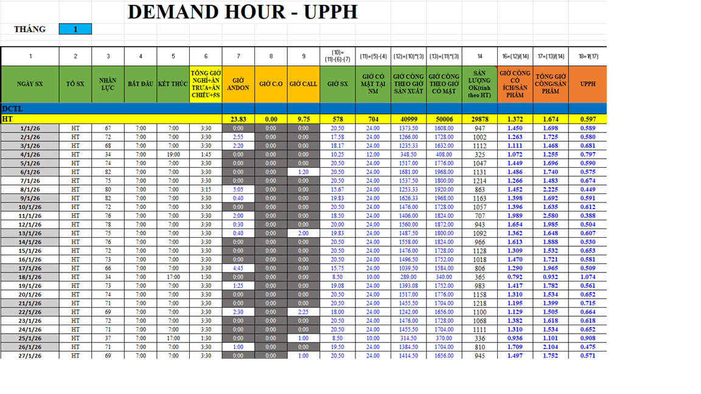
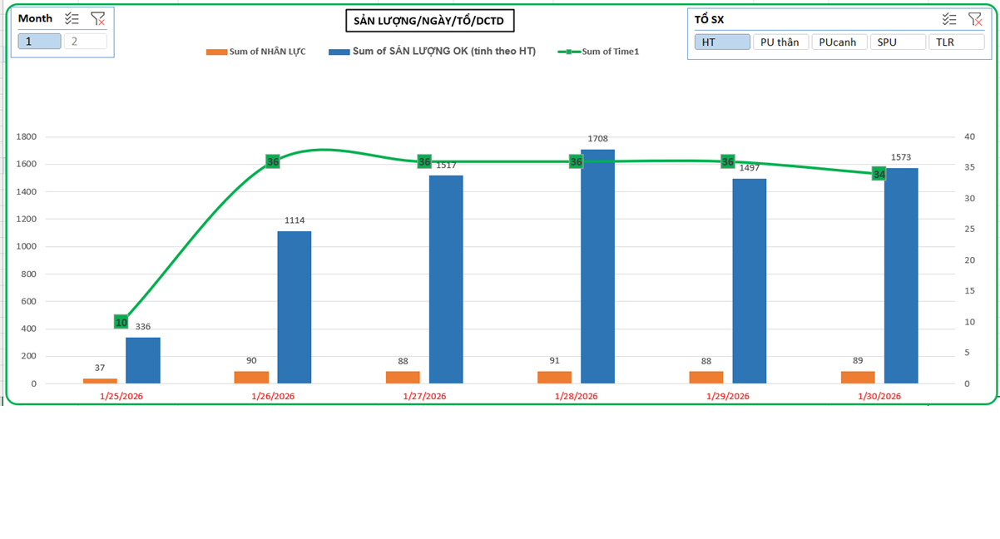

## Production Data Analysis - PU Wing & Body Refrigerator Assembly Lines

### Project Overview
A data analytics platform designed to evaluate manufacturing performance across multiple production lines and teams. By analyzing workforce, time, and output data, the project calculates key metrics to assess productivity, labor efficiency, and production costs.

### Screenshot

### Data Description
* Data is recorded per shift (day/night), capturing output by product code, workforce size,
operating hours, and the key efficiency metric UPPH (Units Per Person Per Hour).
* Output volume by product code (51CD, 71, 91, 1.6, 3.2, 10.6, ...)
* Headcount per shift
* Shift start/end times, lunch break, dinner break, short breaks, and 5S time
* Actual UPPH vs. Demand targets
* Incident notes: line breakdowns, material shortages, mold issues, etc.
### Analyses Performed
* Calculation of actual working hours (Time1, Time2, Hours1, Hours2)
* UPPH tracking by day and by team
* Output aggregation by product type and month
### Tool used
* Microsoft Excel (power query, combo chart, formulas, pivot tables, conditional formatting, advand formulas) 
  * Power query: Data extraction, cleaning, and transformation (ETL)
  * Pivot Table: Multi-dimensional data summarization
  * Pivot Chart + Slicer: Interactive visual dashboard with dynamic filtering
  * Conditional Formatting: Visual alerts for KPI thresholds
  * Excel Formulas: Working hour calculations, UPPH computation
